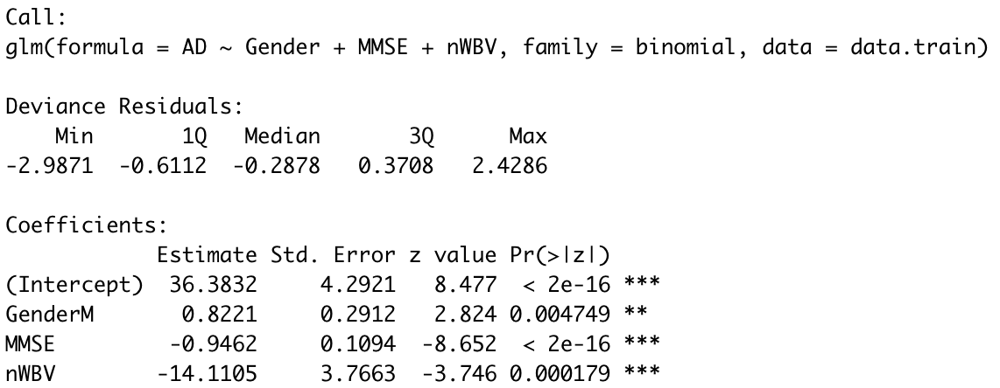

### [Github](https://github.com/ChiaPatricia/Alzheimer-s-Disease-Classification) 
### [Data Science Live](https://jh-cai.com/modern-data-mining/dsl5.html)

---
```toml
# basic color options: use only color names as shown in the
# "Color Palette" section of http://tachyons.io/docs/themes/skins/
siteBgColor = "near-white"
sidebarBgColor = "light-gray"
headingColor = "black"
textColor = "dark-gray"
sidebarTextColor = "mid-gray"
bodyLinkColor = "blue"
navLinkColor = "near-black"
sidebarLinkColor = "near-black"
footerTextColor = "silver"
buttonTextColor = "near-white"
buttonBgColor = "black"
buttonHoverTextColor = "white"
buttonHoverBgColor = "blue"
borderColor = "moon-gray"
```

```{r setup, include=FALSE}
knitr::opts_chunk$set(fig.height=3, fig.width=5, warning = F)
if (!require("pacman")) install.packages("pacman")
pacman::p_load(data.table,randomForest, tree, ISLR, rpart, gbm, rpart.plot, caret, car, MASS, rattle, pROC, partykit, ggplot2, glmnet, leaps, dplyr, keras, neuralnet, imager, ranger, elasticnet,factoextra, stargazer, keras, xgboost, randomForestExplainer, DiagrammeR, SHAPforxgboost, ggalt, ggExtra, ggcorrplot, rstatix)
```


# I. Abstract

Alzheimer’s disease (AD) is the most common type of dementia which leads to memory loss and decline in thinking. AD is a progressive disease and usually starts slowly, but changes in the brain can begin many years before the appearance of first symptoms.

In this study, we aim to use demographic and Magnetic Resonance Imaging (MRI) data for both demented and nondemented adults to build classifiers that predict whether a subject will be diagnosed to develop dementia. Two datasets are used: one deals with cross-sectional MRI data for adults aged between 18 to 96, and the other deals with longitudinal MRI data for older adults between 60 to 96. 

Our [datasets](https://www.kaggle.com/datasets/jboysen/mri-and-alzheimers?select=oasis_longitudinal.csv) can be found in Kaggle. The data was originally collected and released by the Alzheimer's Disease Research Center at Washington University and Open Access Series of Imaging Studies (OASIS).

# II. Description of the Data

The following table showcases the features that the data contains:

|  Variable Name   | Description |
|-------|-------|
| ID | The unique identification of an MRI session|
| M.F | Gender of the subject |
| Age | Age of the subject |
| Hand | Dominant hand |
| EDUC | Years of education |
| SES | Socialeconomic status |
| MMSE | Mini Mental State Examination score |
| eTIV | Estimated total intracranial volume |
| nWBV | Normalized whole brain volume |
| ASF | Atlas Scaling factor |
| MR.Delay | MRI delay time |
| CDR | Clinical Dementia Rating |

Here are some more detailed explanations of the terms mentioned above:

Mini Mental State Examination (MMSE): This is a 30-point questionnaire which has been widely adopted to measure cognitive functions of individuals, especially among elderly people.

Estimated total intracranial volume (eTIV): This is an estimated value of the maximum pre-morbid brain volume.

Atlas scaling factor (ASF): This is a volume-scaling factor that standardizes the head size based on differences in human anatomy.

MR Delay: A delayed MR is performed a few minutes after the injection of the contrast agent. The delayed contrast enhancement might reveal different biological information.

Clinical Dementia Rating (CDR): This is a globally accepted measure of the overall severity of dementia and Alzheimer's disease. The score has the following 5 values:

0 - Normal

0.5 - Very Mild Dementia

1 - Mild Dementia

2 - Moderate Demantia

3 - Severe Demantia


## Target Value

We will predict whether the subject has developed Alzheimer's disease based on the Clinical Dementia Rating. If the subject has a zero CDR score, the subject has no AD, thus receiving a label of 0. If the score is greater than zero, the subject has developed AD, thus will be marked as 1.

# III. Data Cleaning and Preparation

We append the cross sectional dataset and the longitudinal dataset in order to get as many MRI session records as possible. In order to do it, we only keep the common variables of the two datasets and rename the variables so that they match across the datasets.

Null values exist in 4 columns: `EDUC` (Years of Education), `SES` (Social-Economic Status), `MMSE` (Mini Mental Score Exam Score), `CDR` (Clinical Dementia Rating). Since the target variable is produced according to CDR, we drop all the observations with no CDR score. For the categorical variable `SES`, we impute missing values with the mode. For the numerical variables `EDUC` and `MMSE`, we impute the missing values with the mean.

We further drop the column `Hand` because all subjects are reported to be right-handed.

In the end, we obtain 608 valid observations with the following variables: `Gender`, `Age`, `EDUC`, `SES`, `MMSE`, `eTIV`, `nWBV`, `ASF`, `CDR`. We create our target variable `AD` based on the value of `CDR`. Specifically, we let `AD` = 0 for `CDR` = 0, and `AD` = 1 for `CDR` > 0.

There are 341 Non-AD observations and 267 AD observations.


```toml
data_cross <- read.csv("data/oasis_cross-sectional.csv")
# all subjects are right-handed. Delay is all empty
data_cross <- data_cross %>% select(-c(Hand, Delay))
# to match the name of data_long
colnames(data_cross)[which(names(data_cross) == "Educ")] <- "EDUC"
head(data_cross)
```


```toml
data_long <- read.csv("data/oasis_longitudinal.csv")
# hand only has one unique value. 
# Group has 3 categories: nondemented, demented, converted. Not interested in converted. Will create our own label.
# Visit, MR.Delay information are not contained in data_cross
data_long <- data_long %>% select(-c(Hand,Group,Subject.ID,Visit, MR.Delay))
colnames(data_long)[which(names(data_long) == "MRI.ID")] <- "ID"
head(data_long)
```


```toml
# combine data_cross and data_long
data <- rbind(data_cross, data_long)
## check the number of columns which have missing values
names(data)[apply(data, 2, function(x) any(is.na(x)))] # "EDUC" "SES"  "MMSE" "CDR" 
sum(is.na(data$EDUC)) # 201
sum(is.na(data$MMSE)) # 203
sum(is.na(data$SES)) # 239
sum(is.na(data$CDR)) # 201
```

```toml
# CDR is the target value. Drop columns where CDR is empty. Fill NA for the other three variables.
data <- data[!is.na(data$CDR),]
# EDUC: 18 different possible values, fill NA with mode
table(data$EDUC)
data[is.na(data$EDUC),"EDUC"] <- 12
# column "SES" refers to social-economic status. It's a categorical variable. fill NA with the mode
table(data$SES)
data[is.na(data$SES),"SES"] <- 2
# column "MMSE" refers to mini-mental state exam score, fill NA with mean
unique(data$MMSE)
mean(na.omit(data$MMSE))
data[is.na(data$MMSE),"MMSE"] <- 27
```


```toml
# change gender to factor. recode
colnames(data)[which(names(data) == "M.F")] <- "Gender"
data$Gender <- as.factor(data$Gender)
# data$Gender <- as.factor(ifelse(data$Gender=="F", 0, 1))
# create label
data$AD <- as.factor(ifelse(data$CDR==0, 0, 1))
data <- data %>% select(-CDR)
```

```toml
summary(data)
```

Below, we provide a summary statistic table for the numerical variables in our dataset.

```toml
num_summary <- data %>%
  get_summary_stats(
    Age, EDUC, SES, MMSE, eTIV, nWBV, ASF,
    type = "common")    
col_to_keep <- c(1,3,4,5,7,8)
knitr::kable(num_summary[,col_to_keep])
```


# IV.Exploratory Data Analysis

In this section, we create several visualizations to investigate the distribution of data and to see the relationship between different variables.

First, we are interested in the demographic distribution. A histogram of age by gender showcases that the distributions of age and gender are roughly balanced. In addition, we notice that the age of subjects tends to be high. Most subjects are aged between 70 to 80 years old. Thus, the data deals mainly with elderly patients.

```toml
ggplot(data = data, aes(x=Age, color = Gender)) +
  geom_histogram(position=position_dodge2(preserve="single"), 
                 aes(fill = Gender, y = ..density..),
                 alpha = 0.8) +
  geom_density(alpha=.1, linetype = 1, lwd = 1.1) +
  labs(title = "Age Distribution by Gender of Subjects",
       x = "Age",
       y = "Number of Subjects") +
  theme_minimal()
  # scale_fill_manual(values = c("#D95F02", "#7570B3")) +
  # scale_color_manual(values = c("#D95F02", "#7570B3"))
```

Next, we visualize the relationship between Mini Mental State Exam score, Age and whether a patient is diagnosed with dementia. On the top, the marginal density plot depicts the distribution of MMSE score by AD label; on the right, the marginal density plot is for the distribution of age.

We see that subjects with AD tend to have lower MMSE score. There are two subjects with very low MMSE score (loewer than 10), and both of them are diagnosed as AD. However, there is no clear relationship between age and AD in this plot. Age and MMSE score does not have a clear association either, as seen in the right marginal plot.

```toml
g <- data %>% 
  ggplot(aes(x = MMSE,y = Age, color = AD)) +
  geom_jitter(alpha = 0.7) +
  labs(title = "MMSE Score, Age and AD",
       x = "Mini Mental State Examination Score") +
  theme_minimal() +
  theme(legend.position = "left")
# ggMarginal(g, type = "histogram", groupColour = TRUE, groupFill = TRUE)
ggMarginal(g, type = "densigram",groupFill = TRUE)
```


We dive deeper into the relationship between MMSE score and AD diagnosis. From the box plot below, we can see that those who are diagnosed with AD have a lower MMSE score in general. The median (the middle horizontal line of the box plot) and mean (marked by the square) are both significantly lower for the AD group.


```toml
data %>%
  ggplot(aes(x=AD, y=MMSE, color = AD)) +
  geom_boxplot(size = 1.5) +
  stat_summary(fun.y=mean, geom="point", shape = 15, size=6) +
  geom_jitter(alpha = 0.1, color = "black") +
  theme_minimal() +
  labs(title = "Mini Mental State Examination Score by AD Group",
       x = "Whether be Diagnoised with AD",
       y = "MMSE Score")
```


We also notice that the estimated total intracranial volume (eTIV) differ between dementia and non-dementia group. People with dementia tend to have a lower eTIV value.

```toml
data %>%
  ggplot(aes(x=AD, y=nWBV, color = AD)) +
  geom_boxplot(size = 1.5) +
  stat_summary(fun.y=mean, geom="point", shape = 15, size=6) +
  geom_jitter(alpha = 0.1, color = "black") +
  theme_minimal() +
  labs(title = "Estimated Total Intracranial Volume by AD Group",
       x = "Whether be Diagnoised with Dementia",
       y = "eTIV")
```


Lastly, we plot the correlation between numerical variables of our dataset. ASF and eTIV have very high negative correlation. nWBV and Age also have a relatively high negative correlation. We choose to keep all these variables for the modeling part. In fact, ASF does not turn out to be significant in any of the models, but eTIV does have some significance.

```toml
data_sel <- data %>% select(-ID, -Gender, -AD)
data_cor <- round(cor(data_sel),3)
ggcorrplot(data_cor, method = "circle", 
           lab = TRUE, lab_size = 3,
           colors = c("#6D9EC1", "white", "#E46726"))
```


# V. Model Building

## Data Splitting

We split the data into three sets: training, testing and validation. The training set is used to fit a model; the testing set is used to report a model's effectiveness; the validation set is held until the end to evaluate our final model. We randomly select 70% of the data to be the training set, 15% of the observations to be the testing set and the remaining 15% to the the validation set.

```toml
# train-validation-test split
N <- length(data$AD)
n1 <- floor(0.7 * N)
n2 <- floor(0.15 * N)
set.seed(10)
idx_train <- sample(N,n1)
idx_no_train <- which(!seq(1:N) %in% idx_train)
idx_test <- sample(idx_no_train, n2)
idx_val <- idx_no_train[which(!(idx_no_train %in% idx_test))]
 
# identification information, i.e. encounter_id and patient_nbr, should not be included in the model
data.train <- data[idx_train,] %>% select(-c(ID))
data.test <- data[idx_test,]  %>% select(-c(ID))
data.val <- data[idx_val,] %>% select(-c(ID))
```


## Model 1: Logistic Classification

### Model Fitting

We first fit a logistic classification model. We select a sparse model by using LASSO regularization technique and use the **cv.glmnet()** function to implement cross validation. The criteria is set to be deviance and 10-fold cross validation is applied. 

The plot below shows how the deviance varies with different values of $\lambda$ and the number of non-zero coefficients.

```toml
X <- model.matrix(AD~., data.train)[,-1]
Y <- data.train[,length(data.train)]
set.seed(10)
fit1.cv <- cv.glmnet(X, Y, alpha=1, family="binomial", nfolds = 10, type.measure = "deviance")
plot(fit1.cv)
```

We start with choosing the set of variables which give the smallest cross-validated error. The 7 variables selected are: `Gender`, `Age`, `EDUC`, `SES`, `MMSE`, `eTIV` and `nWBV`.

```toml
coef.1se <- coef(fit1.cv, s = "lambda.min")
coef.1se <- coef.1se[which(coef.1se != 0),]
vars <- rownames(as.matrix(coef.1se))
vars
```

```toml
fit.logit <- glm(AD~Gender+ Age + EDUC + SES + MMSE + eTIV + nWBV, family=binomial, data=data.train)
summary(fit.logit)
```


### Fine Tuning

Fitting the logistic model using these variables, we notice that not all the variables are significant at level 0.05. Thus, based on this model, we proceed to perform backward selection until all the remaining variables are significant at level 0.05.

In the end, only three variables remain, which are `Gender`, `MMSE` and `nWBV`. In fact, we notice that this is exactly the same set of variables corresponding to `lambda.1se`, which is the largest value of $\lambda$ such that the cross-validated error is within 1 standard error of the minimum cross-validated error.

Our final logistic model gives the following result:



```toml
fit.logit.final <- glm(AD~Gender+ MMSE + nWBV, family=binomial, data=data.train)
summary(fit.logit.final)
```

### Analysis

Based on the summary table of the model, the logit function is given by:

\begin{split}
logit(P(AD=1 \mid Gender, MMSE, nWBV)) 
&= log(\frac{P(AD=1 \mid Gender, MMSE, nWBV)}{P(AD=0 \mid Gender, MMSE, nWBV)}) \nonumber\\
&= 36.38 + 0.82 \cdot Gender(Male) - 0.95 \cdot MMSE - 14.11 \cdot nWBV
\end{split}


where

\begin{split}
P(AD=1 \mid Gender, MMSE, nWBV) = \frac{exp(36.38 + 0.82 \cdot Gender(Male) - 0.95 \cdot MMSE - 14.11 \cdot nWBV)}{1 + exp(36.38 + 0.82 \cdot Gender(Male) - 0.95 \cdot MMSE - 14.11 \cdot nWBV)}
\end{split}


Here, we will assume that it costs equally to mislabel a subject to be AD as it does to mislabel a non-AD. Thus, we will set the threshold to be 0.5. That is, 


\hat{AD} = 1 \text{ if  } \hat P(AD=1 \mid Gender, MMSE, nWBV) > 0.5


```toml
#use test dataset to estimate misclassification error
fit.logit.final.test <- predict(fit.logit.final,data.test,type = "response")
logit.pred <- as.factor(ifelse(fit.logit.final.test > 1/2, 1, 0))
logit.error <- mean(logit.pred != data.test$AD)
round(logit.error,3)
logit.cm <- table(logit.pred, data.test$AD)
logit.cm
```


Using the testing dataset to evaluate the performance of this model, the misclassification error rate turns out to be 0.198. The confusion matrix is given below.

|     | $Y=0$ | $Y=1$ |
|-------|-------|-------|
| $\hat{Y}=0$ | 41 | 11 |
| $\hat{Y}=1$ | 7 | 32 |

This model has a sensitivity rate of 0.744 and a specificity rate of 0.854.

```{r, include=F}
logit.recall <- logit.cm[2,2]/sum(logit.cm[,2])
round(logit.recall,3) # sensitivity, recall
specificity <- logit.cm[1,1]/sum(logit.cm[,1])
#round(specificity,3) # specificity
fdr <- logit.cm[2,1] / sum(logit.cm[2,]) # false discovery rate
#fdr
logit.precision <- logit.cm[2,2] / sum(logit.cm[2,]) # positive prediction, precision
round(logit.precision,3)
logit.f1 <- (2*logit.recall*logit.precision)/(logit.recall + logit.precision)
logit.f1
```


### Findings

With very few variables remaining in the logistic regression model, the result is rather simple to interpret. The model suggests that `MMSE`, `nWBV` and `age` are the top 3 important variables in predicting one's probability of developing Alzheimer. The log odds is a decreasing function of MMSE and nWBV. Holding other variables constant, when the score of Mini Mental State Exam decreases, the probability of being diagnosed with AD increases. Similarly, decrease in the normalized whole brain volume also implies higher probability of AD diagnosis. The model also suggests that male has higher a probability of developing dementia. Specifically, holding MMSE score and nWBV constant, the log odds increases 0.82 for a male subject compared with a female subject.


## Model 2 Random Forest 

### Model Fitting and Fine Tuning

The second model that we build is a random forest model. We first set `mtry` (number of randomly chosen predictors at each split) to be 3, which is the square root of the number of predictors. We set `ntree` to be 500. The split criterion is set to be misclassification error.

By plotting the error rate v.s number of trees, we decide to use 300 trees in order to settle down the OOB testing errors.

```toml
set.seed(1)
fit.rf <- randomForest(AD~., data.train, mtry = 3, 
                    ntree = 500)
# Three curves of MCE of 1's, 0's and  overall.
plot(fit.rf)
legend("topright", colnames(fit.rf$err.rate), col=1:3, cex=0.8, fill=1:3)
```
 
Then, by setting `ntree=300`, we want to compare effects of different `mtry`. Thus, we loop `mtry` from 1 to 10 and return the testing OOB errors for each of the model. In the end, we decide to use `mtry=2` which gives the minimum error rate.

```toml
set.seed(3)
rf.error <- 1:10  
for (p in 1:10)  
{
  fit.rf <- randomForest(AD~., data.train, mtry = p, ntree = 300)
  rf.error[p] <- fit.rf$err.rate[250]  # collecting oob error rate based on 250 trees
}
plot(1:10, rf.error, pch=16,
     main = "Testing errors of mtry with 250 trees",
     xlab="mtry",
     ylab="OOB mse of mtry",
     col = 8,
     lwd = 15,
     ylim = c(0.13, 0.17))
lines(1:10, rf.error, lwd = 5, col = 8)
points(2, rf.error[2], col = 2, lwd = 13, pch = 19)
```

### Analysis

Using 0.5 as threshold to determine the class of instances in the test dataset, the misclassification rate of our final random forest model is 0.143, the sensitivity rate is 0.814 and the specificity rate is 0.896. The confusion matrix is given below and we can see that the model roughly achieves a balance to predict positive and negative class.


|     | $Y=0$ | $Y=1$ |
|-------|-------|-------|
| $\hat{Y}=0$ | 43 | 8 |
| $\hat{Y}=1$ | 5 | 35 |

```toml
set.seed(3)
fit.rf.final <- randomForest(AD~., data.train, 
                             mtry = 2, 
                             ntree = 300)
fit.rf.final.prob <- predict(fit.rf.final, data.test, type = 'prob')
fit.rf.final.pred <- as.factor(ifelse(fit.rf.final.prob[,2] > 1/2, 1, 0))
fit.rf.test.err <- mean(data.test$AD != fit.rf.final.pred)
fit.rf.test.err
```


```toml
rf.cm  <- table(fit.rf.final.pred, data.test$AD)
rf.cm
```


```toml
rf.recall <- rf.cm[2,2]/sum(rf.cm[,2])
round(rf.recall,3)
rf.precision <- rf.cm[2,2] / sum(rf.cm[2,]) # positive prediction, precision
round(rf.precision ,3)
rf.f1 <- (2*rf.recall*rf.precision)/(rf.recall + rf.precision)
rf.f1
```


### Findings

From the variable importance plot of our final random forest model, we can see that MMSE is the most important feature in this model. nWBV and Age also have high importance. This result corresponds with the finding of logistic classification model.

```{r, echo = F, fig.height = 4, fig.width = 6}
set.seed(3)
varImpPlot(fit.rf.final)
```

The plot below demonstrates the distribution of minimal depth among all the trees in the forest. The vertical bar is the mean of minimal depth for each feature. This plot can give us a clearer idea of the role that each feature plays in our model. 

We can see that MMSE and nWBV are more likely to be the root of the tree compared to other variables. The average minimal depths of MMSE and nWBV are around 1.5, suggesting that many dementia observations can be separated effectively on the basis of these two variables.

```toml
# min_depth <- min_depth_distribution(fit.rf.final)
# save(min_depth, file = "RData/min_depth.rda")
load("RData/min_depth.rda")
plot_min_depth_distribution(min_depth)
```

```toml
# importance_frame <- measure_importance(fit.rf.final)
# plot_multi_way_importance(importance_frame, size_measure = "p_value")
```


## Model 3 & 4: Boosting

### Model Fitting and Fine Tuning

For boosting, we implement both gradient boosting and extreme gradient boosting model. Both models turn out to produce similar results on the testing dataset.

We use the grid search method which iterates over many possible combinations of hyperparameter values, thus determining the best-performing set of hyperparameters. 

In the case of gradient boosting, the `distribution` is set to be `multinomial`. We then look at 135 models with various combinations of learning rate, tree numbers, tree depth and minimum number of observations in the end node. We apply 10-fold cross validation and record the minimum cross validated error for each of the model. 

```{r, eval = F, include = F}
## DO NOT RUNNNNNNNNN THIS CHUNKKKKK
## Gradient Boosting
# hyper_grid <- expand.grid(shrinkage = c(.0075, .01, .0125, .015, .0175),
#                           n.trees = c(500, 800, 1000),
#                           interaction.depth = c(1, 3, 5),
#                           n.minobsinnode = c(5, 10, 15))
# 
# nrow(hyper_grid)
# 
# for(i in 1:nrow(hyper_grid)) {
#     print (i)
#   
#     set.seed(1)
#     fit.gbm.tune <- gbm(AD~.,distribution = "multinomial",
#                     data = data.train,
#                     n.trees = ntree,
#                     interaction.depth = hyper_grid$interaction.depth[i],
#                     shrinkage = hyper_grid$shrinkage[i],
#                     n.minobsinnode = hyper_grid$n.minobsinnode[i],
#                     cv.folds = 10,
#                     n.cores = NULL,
#                     verbose = FALSE)
#     
#     hyper_grid$min_cv_error[i] <- min(fit.gbm.tune$cv.error)
#   }
# 
# 
# hyper_grid %>%
#     dplyr::arrange(min_cv_error) %>%
#     head(3)
# save(hyper_grid,file='RData/hyper_grid.RData')
```

```{r,include = F}
load('RData/hyper_grid.RData')
```

```toml
set.seed(2)
fit.gbm.final <- gbm(AD~ .,
                    distribution = "multinomial",
                    data = data.train,
                    n.trees = 1000,
                    interaction.depth = 5,
                    shrinkage = 0.01,
                    n.minobsinnode = 15,
                    cv.folds = 10,
                    n.cores = NULL, 
                    verbose = FALSE) 
```


In the case of extreme gradient boosting, we apply 10-fold cross validation and set the `early_stopping round` to be 50 to avoid overfitting. This means that the algorithm will be forced to stop if we do not see an improvement of the model's performance in 50 iterations. Similar to the implementation of gradient boosting, we use grid search and test 240 models in total. We tune hyperparameters including learning rate, tree depth, minimum loss reduction for a split and penalty on the number of leaves in a tree, etc.


```toml
## extreme gradient boosting
data.train$AD <- as.numeric(as.factor(data.train$AD))-1
data.test$AD <- as.numeric(as.factor(data.test$AD))-1
data.val$AD <- as.numeric(as.factor(data.val$AD))-1
dtrain <- xgb.DMatrix(data = select(data.train, -AD) %>% data.matrix,
                     label = pull(data.train, AD))
dtest <- xgb.DMatrix(data = select(data.test, -AD) %>% data.matrix,
                    label = pull(data.test, AD))
dval <- xgb.DMatrix(data = select(data.val, -AD) %>% data.matrix,
                    label = pull(data.val, AD))
params <- list(booster = 'gbtree',    
              eta = 0.2, 
              max_depth = 3, 
              subsample = 0.7, 
              gamma = 1, 
              colsample_bytree = sqrt(ncol(data.train)-1) / sqrt(ncol(data.train)-1),
              min_child_weight = 1, 
              objective = 'binary:logistic' )
xgb.cv.result <- xgb.cv(data=dtrain, params = params, nrounds = 500,
                       early_stopping_rounds = 50,
                       nfold = 10,
                       prediction = TRUE,
                       verbose = 0)
```


```toml
## DO NOT RUNNNNNNNNN
# set.seed(1)
# # ntrees = xgb.cv.result$best_iteration
# param_grid = expand.grid(
#   nrounds = 300,
#   eta = seq(2,24,2)/300,
#   subsample = 0.7,
#   colsample_bytree = sqrt(ncol(data.train)-1) / sqrt(ncol(data.train)-1),
#   max_depth = c(1,2,3,4,5),
#   gamma = c(0.3, 0.5, 0.8, 1),
#   min_child_weight = 1
# )
# 
# xgb_control <- trainControl(
#   method="cv",
#   number = 10
# )
# 
# xgb.tuned <- train(AD~., data=data.train, trControl=xgb_control, tuneGrid=param_grid, lambda=0, method="xgbTree" ,objective = 'binary:logistic' )
# 
# save(xgb.tuned,file='RData/xgb.tuned.RData')
```

```toml
load('RData/xgb.tuned.RData')
# xgb.tuned$bestTune
```


### Analysis

Both gradient boosting model and extreme gradient boosting model give an error rate of 0.143.

The confusion matrix of gradient boosting model is:

|           | $Y=0$ | $Y=1$ |
|-----------|-------|-------|
|$\hat{Y}=0$|  44   |   9   |
|$\hat{Y}=1$|  4    |   34  |

The confusion matrix of extreme gradient boosting model is:


|           | $Y=0$ | $Y=1$ |
|-----------|-------|-------|
|$\hat{Y}=0$|  42   |   7   |
|$\hat{Y}=1$|  6    |   36  |

We see that on this specific testing dataset, gradient boosting model has fewer false discovery cases than the extreme gradient boosting model. On the other hand, extreme gradient boosting model has a better balance between false negative and false positive rate. Overall, the performance of the two boosting methods are rather similar.


```toml
# gradient boosting result
fit.gbm.prob <- predict(fit.gbm.final, n.trees = fit.gbm.final$n.trees, data.test)
pred.gbm <- as.factor(ifelse(fit.gbm.prob[,2,] >= 0, "1", "0"))
gbm.error <- mean(data.test$AD != pred.gbm )
gbm.error
gb.cm <- table(pred.gbm, data.test$AD)
gb.cm
```


```toml
gb.recall <- gb.cm[2,2]/sum(gb.cm[,2])
round(gb.recall,3)
gb.precision <- gb.cm[2,2] / sum(gb.cm[2,]) # positive prediction, precision
round(gb.precision ,3)
gb.f1 <- (2*gb.recall*gb.precision)/(gb.recall + gb.precision)
gb.f1
```

```toml
# extreme gradient boosting result
colnames(dtest) <- NULL
pred<- predict(xgb.tuned$finalModel, dtest)
xgb.pred <- as.factor(ifelse(pred >= 0.5, "1", "0"))
xgb.error <- mean(data.test$AD != xgb.pred)
xgb.error
xgb.cm <- table(xgb.pred, data.test$AD)
xgb.cm 
```


```toml
xgb.recall <- xgb.cm[2,2]/sum(xgb.cm[,2])
round(xgb.recall,3)
xgb.precision <- xgb.cm[2,2] / sum(xgb.cm[2,]) # positive prediction, precision
round(xgb.precision ,3)
xgb.f1 <- (2*xgb.recall*xgb.precision)/(xgb.recall + xgb.precision)
xgb.f1
```


### Findings

Below, the table shows the top 5 important features in the Extreme Gradient Boosting model.
```toml
xgb.top5 <- head(xgb.importance(model=xgb.tuned$finalModel),5) %>% select(-Cover)
knitr::kable(xgb.top5)
```

The `gain` measures the contribution of the feature to the model. We can see that MMSE has a significantly higher `gain` than other variables. The `frequency` measures the relative proportion of times for which a feature occurs in the trees. We see that nWBV and eTIV have high `frequency`. MMSE and Age also have relatively high `frequency`.


We also create a SHAP (SHapley Additive exPlanation) visualization plot for the Extreme Gradient Boosting model. The SHAP value demonstrates the contribution of each feature value to the prediction of dementia. We can see that high values of Mini Mental State exam score, low values of normalized whole brain volume, and low values of estimated total intracranial volume have significant impacts on the prediction of dementia.

```toml
X_train <- select(data.train, -AD) %>% data.matrix
X_train[,1] <- ifelse(X_train[,1] ==1, 1, 0)
colnames(X_train)[1] <- "GenderM"
shap_values <- shap.values(xgb_model = xgb.tuned$finalModel, 
                           X_train = X_train)
shap.plot.summary.wrap2(shap_values$shap_score, X_train)
```

We now display the first tree in the Extreme Gradient Boosting model. We see that the first cut is based on MMSE and the second cut is based on nWBV. Age and eTIV appear in subsequent cuts. This roughly corresponds to the feature importance analysis above. 

```toml
xgb.plot.tree(model = xgb.tuned$finalModel, trees = 1)
```

## Model 5: Ensemble Model

We have built four models in total: logistic classification, random forest, gradient boosting and extreme gradient boosting. Taking the majority vote of the result of these four models gives us the fifth model. 

The miclassification error is about 0.143. The confusion matrix is shown below.

|           | $Y=0$ | $Y=1$ |
|-----------|-------|-------|
|$\hat{Y}=0$|  43   |   8   |
|$\hat{Y}=1$|  5    |   35  |


```toml
combined.res <- data.frame(cbind(as.character(logit.pred), 
                                 as.character(fit.rf.final.pred), 
                                 as.character(pred.gbm), 
                                 as.character(xgb.pred)))
colnames(combined.res) <- c("logit", "rf", "gbm", "xgb")
combined.res$logit <- as.numeric(combined.res$logit)
combined.res$rf <- as.numeric(combined.res$rf)
combined.res$gbm <- as.numeric(combined.res$gbm)
combined.res$xgb <- as.numeric(combined.res$xgb)
ensemble_func <-  function(a, b, c, d) (a + b + c + d)>=2
combined.res$ensemble <- apply(combined.res, 1, 
                                function(x) 
                                  ensemble_func(x["logit"], x["rf"], x["gbm"], x["xgb"]))
combined.res$ensemble <- as.numeric(combined.res$ensemble)
ensemble.pred <- combined.res$ensemble
ensembled_error <- mean(ensemble.pred != data.test$AD)
ensembled_error 
```

```toml
ensemble.cm  <- table(ensemble.pred, data.test$AD)
ensemble.cm
ensemble.recall <- ensemble.cm[2,2]/sum(ensemble.cm[,2])
round(ensemble.recall,3)
ensemble.precision <- ensemble.cm[2,2] / sum(ensemble.cm[2,]) # positive prediction, precision
round(ensemble.precision ,3)
ensemble.f1 <- (2*ensemble.recall*ensemble.precision)/(ensemble.recall + ensemble.precision)
ensemble.f1
```


## Final Model & Validation

We now compare the testing error and the F1 score of these five models.

```toml
res.comp <- data.frame(
  Model = c("Logistic Model", "Random Rorest",  "Gradient Boosting Machine", "Extreme Gradient Boosting", "Ensemble Model"),
  `Test Error` = round(c(logit.error, fit.rf.test.err, gbm.error ,xgb.error, ensembled_error),3),
  `F1 Score` = round(c(logit.f1, rf.f1, gb.f1, xgb.f1, ensemble.f1),3)
  )
knitr::kable(res.comp)
```

We see that logistic regression has the highest testing error and lowest F1 Score. The other 4 models give the same testing error, but Extreme Gradient Boosting has a slightly higher F1 score. 

We will still choose the ensemble model as our final model, since the ensemble method can help reduce variance and can be more robust. We use the validation dataset to evaluate our final model. The misclassification error rate turns out to be 17.4%. The model has a recall rate of 94.4% and a precision rate of 70.1%. Below, the confusion matrix suggests that the ensemble model has a high false discovery rate, which turns out to be 29.2%.


|           | $Y=0$ | $Y=1$ |
|-----------|-------|-------|
|$\hat{Y}=0$|  42   |   2   |
|$\hat{Y}=1$|  14   |   34  |


# VI. Conclusion

In this study, we use demographic and MRI imaging data of 608 observations to build different machine learning models for predicting dementia. We set the probability threshold to be 0.5 and the performance across different models are comparable. We have also used the majority vote of four models to build an ensemble model, but do not see significant improvement of results.

The Mini Mental State Exam score turns out to have high significance in all of the models we build, including logistic classification, random forest and boosting model. This suggests that a person with low mini mental state exam score will be more likely to be diagnosed with dementia. 

In addition, `gender`, `age`, `nWBV` (normalized whole brain volume) and `eTIV` (estimated total intracranial volume) also show significance in our models. It is worth noting that different models give different ranks of the features. For instance, while `gender` turns out to be significant in our final logistic classification model, it is not a significant factor in random forest and boosting. 

Combining the results across different models, we conclude that subjects who are male, who have higher age, smaller normalized whole brain volume and smaller estimated total intracranial volume will have a higher chance of being diagnosed with dementia.


# VII. Reference 

Fulton, L.V.; Dolezel, D.; Harrop, J.; Yan, Y.; Fulton, C.P. Classification of Alzheimer’s Disease with and without Imagery Using Gradient Boosted Machines and ResNet-50. Brain Sci. 2019, 9, 212. https://doi.org/10.3390/brainsci9090212

Knight Alzheimer Disease Research Center, CDR Scoring Table: https://knightadrc.wustl.edu/professionals-clinicians/cdr-dementia-staging-instrument/cdr-scoring-table/


```toml
# logit val
logit.val.prob <- predict(fit.logit.final,data.test,type = "response")
logit.val.pred <- as.factor(ifelse(logit.val.prob > 1/2, 1, 0))
# random forest val
rf.val.prob <- predict(fit.rf.final, data.val, type = 'prob')
rf.val.pred <- as.factor(ifelse(rf.val.prob[,2] > 1/2, 1, 0))
# gbm val
gbm.val.prob <- predict(fit.gbm.final, n.trees = fit.gbm.final$n.trees, data.val)
gbm.val.pred <- as.factor(ifelse(gbm.val.prob[,2,] >= 0, 1, 0))
# xgb val
colnames(dval) <- NULL
pred <- predict(xgb.tuned$finalModel, dval)
xgb.val.prob <- predict(xgb.tuned$finalModel, dval)
xgb.val.pred <- as.factor(ifelse(xgb.val.prob  >= 0.5, 1, 0))
# combine results + ensemble
val.res <- data.frame(cbind(as.character(logit.val.pred),
                            as.character(rf.val.pred), 
                            as.character(gbm.val.pred), 
                            as.character(xgb.val.pred)))
colnames(val.res) <- c("logit", "rf", "gbm", "xgb")
val.res$logit <- as.numeric(val.res$logit)
val.res$rf <- as.numeric(val.res$rf)
val.res$gbm <- as.numeric(val.res$gbm)
val.res$xgb <- as.numeric(val.res$xgb)
val.res$ensemble <- apply(val.res, 1, 
                                function(x) ensemble_func(x["logit"], x["rf"], x["gbm"], x["xgb"]))
val.res$ensemble <- as.numeric(val.res$ensemble)
```


```toml
# validation result
ensemble.val.pred <- val.res$ensemble
ensembled.val.error <- mean(ensemble.val.pred != data.val$AD)
ensembled.val.error
val.cm  <- table(ensemble.val.pred, data.val$AD)
val.cm
val.recall <- val.cm[2,2]/sum(val.cm[,2])
round(val.recall,3)
val.precision <- val.cm[2,2] / sum(val.cm[2,]) # positive prediction, precision
round(val.precision ,3)
val.f1 <- (2*val.recall*val.precision)/(val.recall + val.precision)
val.f1
fdr <- val.cm[2,1] / sum(val.cm[2,])
fdr
```

```toml
combined.res <- data.frame(cbind(as.character(logit.pred), 
                                 as.character(fit.rf.final.pred), 
                                 as.character(pred.gbm), 
                                 as.character(xgb.pred)))
logit.roc <- roc(data.test$AD, as.numeric(logit.pred))
plot(1-logit.roc$specificities, logit.roc$sensitivities, 
     col = "red", lwd = 3, type = "l",
    xlab = "False Positive",
    ylab = "True Positive (Sensitivity)",
    main = "Logistic Regression Model: ROC Curve")
legend("bottomright", c(paste0("AUC = ", round(logit.roc$auc,2))),
       col = c("red"))
```
 
```toml
fit.rf.final.roc <- roc(data.test$AD, fit.rf.final.prob[,2])
plot(1-fit.rf.final.roc$specificities, fit.rf.final.roc$sensitivities, 
     col = "red", lwd = 3, type = "l",
    xlab = "False Positive",
    ylab = "True Positive (Sensitivity)",
    main = "Final Model: ROC Curve")
legend("bottomright", c(paste0("AUC = ", round(fit.rf.final.roc$auc,2))),
       col = c("red"))
```
 
```toml
fit.gbm.final.roc <- roc(data.test$AD, fit.rf.final.prob[,2])
plot(1-fit.rf.final.roc$specificities, fit.rf.final.roc$sensitivities, 
     col = "red", lwd = 3, type = "l",
    xlab = "False Positive",
    ylab = "True Positive (Sensitivity)",
    main = "Final Model: ROC Curve")
legend("bottomright", c(paste0("AUC = ", round(fit.rf.final.roc$auc,2))),
       col = c("red"))
```
 
