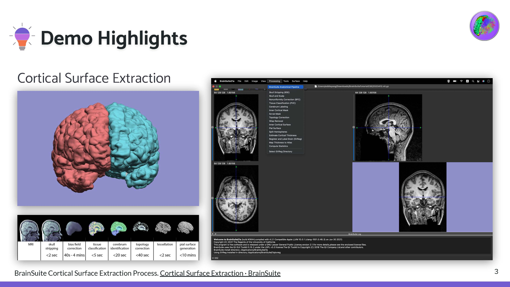
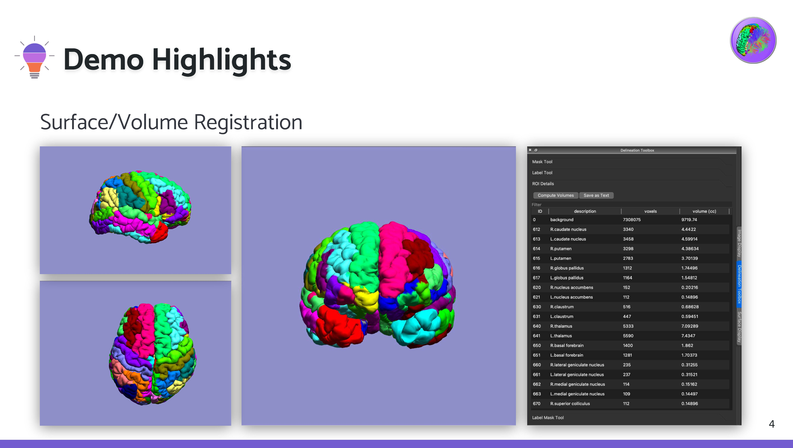
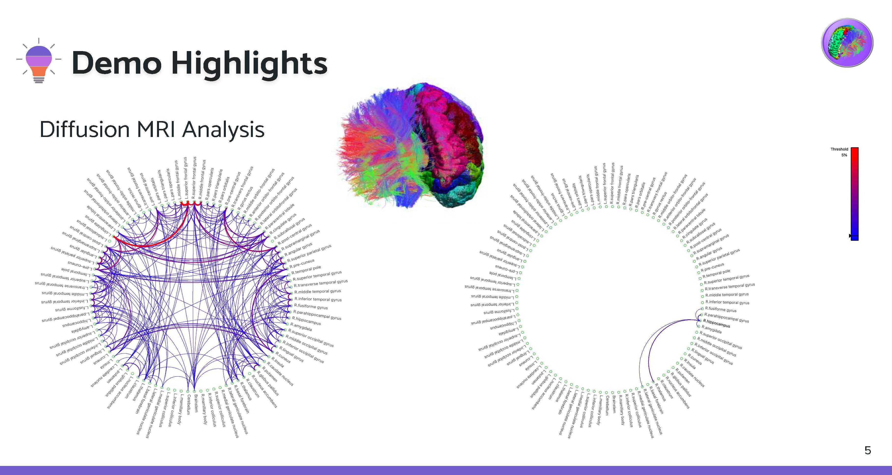
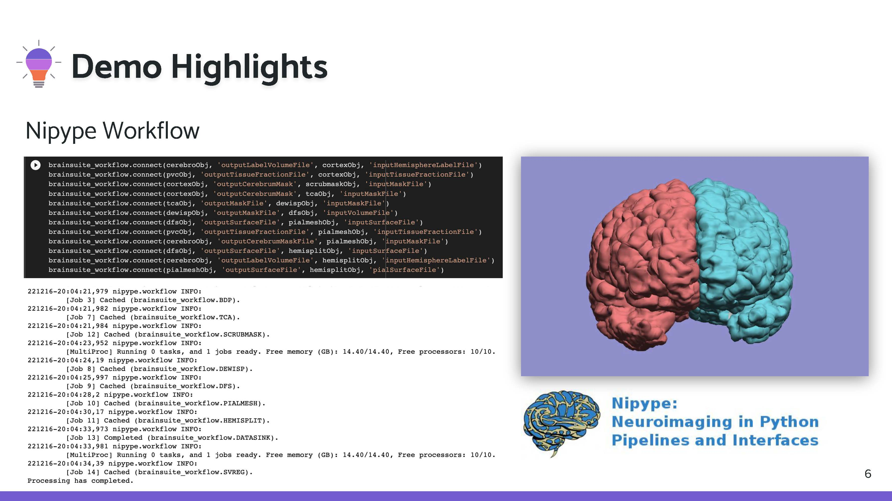
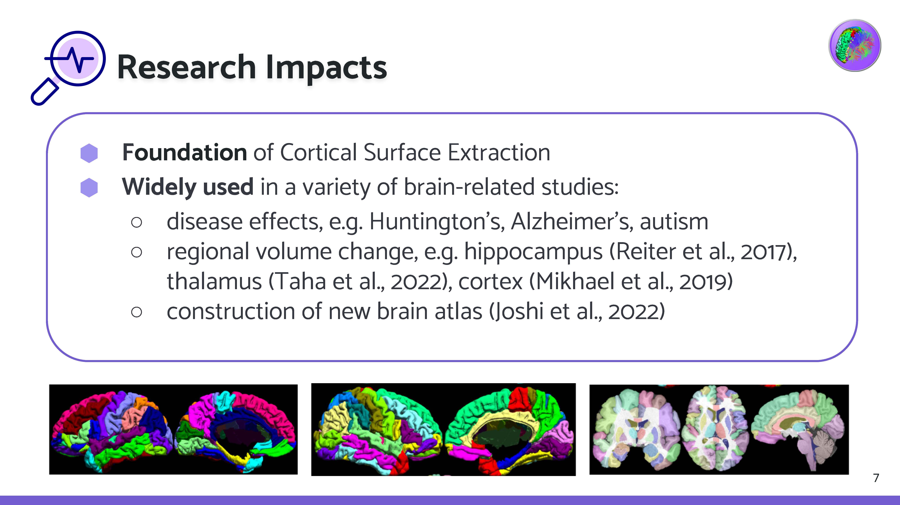
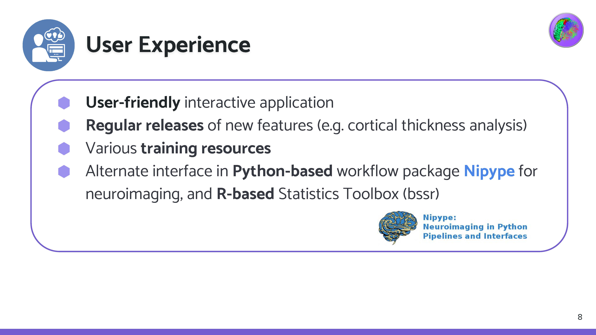
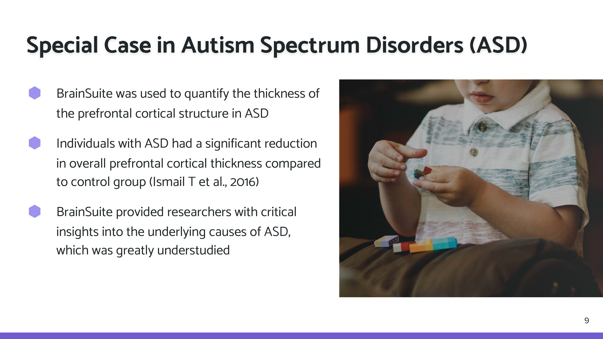

---

# Overview

BrainSuite comes as an interactive tool with GUI support, which enables researchers to work without specialized programming knowledge. However, for those comfortable with coding, customizable workflow is also available through BrainSuite module in Nipype Interface.
For all the cool things about BrainSuite, why don’t we go ahead into our demo highlights.

---
### Demo Highlights

---
### Research Impacts

---
### User Experience

---
### Special Case in Autism Spectrum Disorders (ASD)

---
### Benefit Summary

---
### Resources & References

Demo jupyter notebook, https://colab.research.google.com/drive/1JcZAn5P2s3T3ChJpbK1h0u-u-IgoEMUY?usp=sharing 
BrainSuite official website

Shattuck, David W, and Richard M Leahy. “BrainSuite: an automated cortical surface identification tool.” Medical image analysis vol. 6,2 (2002): 129-42. doi:10.1016/s1361-8415(02)00054-3

Tran, Anh Phong, and Qianqian Fang. "Fast and high-quality tetrahedral mesh generation from neuroanatomical scans." arXiv preprint arXiv:1708.08954 (2017).

Mikhael, Shadia S., and Cyril Pernet. "A controlled comparison of thickness, volume and surface areas from multiple cortical parcellation packages." BMC bioinformatics 20.1 (2019): 1-12.

Ismail, Marwa M T et al. “Studying Autism Spectrum Disorder with Structural and Diffusion Magnetic Resonance Imaging: A Survey.” Frontiers in human neuroscience vol. 10 211. 11 May. 2016, doi:10.3389/fnhum.2016.00211

Postema, Merel C., et al. "Altered structural brain asymmetry in autism spectrum disorder in a study of 54 datasets." Nature communications 10.1 (2019): 1-12.

Yankowitz, Lisa D., et al. "Dissociating regional gray matter density and gray matter volume in autism spectrum condition." NeuroImage: Clinical 32 (2021): 102888.

Reiter, Katherine, et al. "Five-year longitudinal brain volume change in healthy elders at genetic risk for Alzheimer’s disease." Journal of Alzheimer's Disease 55.4 (2017): 1363-1377.
Shattuck, D W et al. “Magnetic resonance image tissue classification using a partial volume model.” NeuroImage vol. 13,5 (2001): 856-76. doi:10.1006/nimg.2000.0730

Taha, Khalid M., et al. "Quantitative Evaluation of Grey Matter Volume of Thalamus in Patients with Depression on Magnetic Resonance Imaging: Segmentation Study." (2022).

Joshi, Anand A., et al. "A hybrid high-resolution anatomical MRI atlas with sub-parcellation of cortical gyri using resting fMRI." Journal of Neuroscience Methods 374 (2022): 109566.
