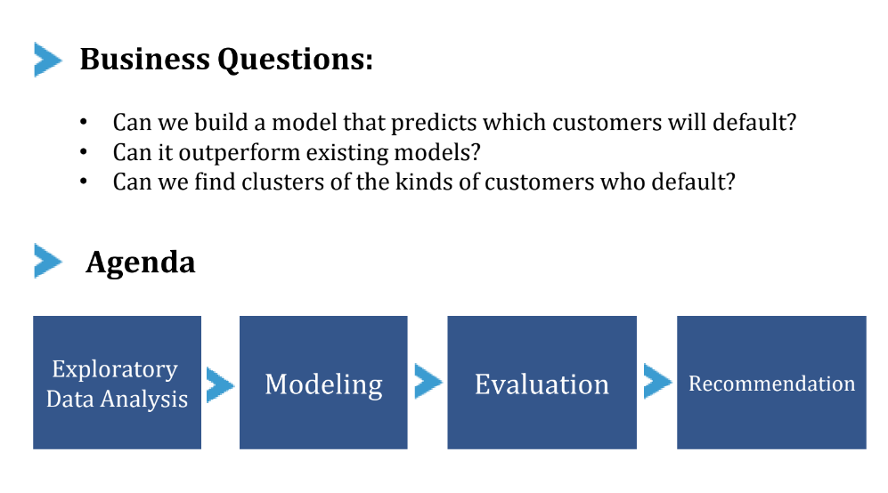

[Wharton Customer Analytics](https://wca.wharton.upenn.edu/students/student-datathons/) connect industry with researchers and students with the goal of innovating the field of data analytics, fostering new relationships and creating dynamic thought leadership. This unique datathon experience was composed of teams made up of both Fulton Bank employees and Penn students challenged with developing insights and recommendations for Fulton Bank using their data around selected business challenges in Consumer and Small Business, Fulton Financial Advisors, Information Technology, Marketing, and Risk Management.

---

$\textbf{MARCH 18 – APRIL 1, 2022}$

This unique datathon experience was composed of teams made up of both Fulton Bank employees and Penn students challenged with developing insights and recommendations for Fulton Bank using their data around selected business challenges in Consumer and Small Business, Fulton Financial Advisors, Information Technology, Marketing, and Risk Management.

$\textbf{ABOUT FULTON BANK}$

Since Fulton Bank opened its doors in 1882, they have strived to deliver the best banking experience for their customers. Today, as part of Fulton Financial Corporation, a $25 billion financial services holding company, Fulton Bank offers a broad array of financial products and services in Pennsylvania, New Jersey, Maryland, Delaware, and Virginia.

Fulton Bank is proud to offer convenience in neighborhoods across the region through over 200 financial centers and specialty offices and almost 300 ATMs.

$\textbf{Our Project: Risk Management}$

$\textbf{Project Type}$: Customer Lifetime Value

$\textbf{Business Question}$: Can we build a model that predicts which customers will default? Can it outperform existing models? Can we find clusters of the kinds of customers who default?

$\textbf{Summary Points}$:

  * Performed the analytical process from exploratory data analysis, model selections, and result interpretations to recommendations to Fulton bank’s risk management strategies based on best-performing models, Linear Discriminant Analysis, Decision Tree, XGBoost models. 

  * Cross-referenced the results of the optimized models and our exploratory data analysis to find clusters of customers who are most likely to default.

# Exploratory Data Analysis

## Data cleaning & Visualization

(For data privacy, all the data will be shown in `-` , cross-referenced results and recommendations are omitted here. Thank you for your understanding!)

The basic characteristics of the dataset and the potential difficulties that we would run into in data cleaning. 

Our dataset has a size of -- rows * -- columns. It is extremely imbalanced with --% of non-default and only -% of default cases. Some column titles are difficult to interpret and the data dictionary is not comprehensive. 

Based on these characteristics, we decided on the following Exploratory Data Analysis approaches. 

First, we examined all column types, the distribution of default cases, missing and unique values, and finally anomalies. We used common data science stacks such as Pandas and Numpy to perform data cleaning and EDA. We discovered that there were undefined and unstructured categorical variables and many null values. To have a better sense of the data, we categorized columns by their meanings and filtered out those that would be hard to explain in the models. We left one column each to represent date, time and id. We dropped columns with high correlations with each other, because they would have strong interaction effects and thus affect model outcomes. 

After preliminary cleaning, we moved forward to feature engineering and decided to use one hot encoding to structure categorical variables. We manually encoded variables  with ambiguous abbreviations in the text  and ran one-hot encoding on them,  so that they wouldn't be automatically coded into uneven values and could be accurately explained in the machine learning models later.

We visualized the correlations by the categories that we made earlier, so that we can get a sense of their effects on default. By plotting correlation graphs, we identified basic trends between variables to prepare further EDA. For example, variables about delinquency and risk rating scores are highly correlated with default. 

# Model 

Our team ran five models in total and chose the best performing ones based on comparisons of accuracy and recall. 

Before constructing our models, we first used Principal Component Analysis to project the high-dimensional data into 3 dimensions. We noticed that default and non-default customers actually do not form separate clusters. We also evaluated the performance of the previous model results presented in the dataset. The previous model had an accuracy rate of --% and was able to identify --% of the actual default, but only -% of the predicted default cases were correct. From this model forward, we aim to look for models that can raise the overall accuracy and achieve a better balance between precision and recall. 

We presented Linear discriminant analysis, decision tree, and extreme gradient boosting, each of which performs better than the previous model in different ways.

The linear Discriminant Analysis model is one of the newest models in credit risk scoring techniques. It is valued so highly in the market because it reduces the number of features to achieve a more manageable data size before classification. The model finds linear combinations of features in order to separate default versus non-default. We chose LDA over PCA because PCA ignores the actual class labels for default versus non-default, so we only used PCA as a reference case to visualize our high-dimensional data, but focused on the results of LDA.

Our model achieved --% overall accuracy, correctly identified --% of actual default cases, and out of all the positive default predictions, --% were correct. This is --% higher in accuracy and a much better balance between precision and recall than the previous model. We then drew a feature coefficients graph and ranked their importance in their effect on default. We can see that,  delinquency days count, risk rating score and indicator for term loans, are among the top ranked features. 

The second model of our choices is Decision Tree. We choose this algorithm because unlike many other machine learning models which are close to black boxes, decision tree can provide a graphical and intuitive way to understand what our algorithm is actually doing, so it’s much easier to offer sensible interpretation. The feature ranking graph demonstrates the significance of delinquency count and risk rating score in predicting default, but more importantly, the graph shows that the mortgage collateral and remaining months left in the loan are highly relevant to the possibility of default. 

The model has the outcomes of --% overall accuracy, --% recall, --% precision. 

Lastly, since decision tree performs not as well as Linear Discriminant Analysis, we looked for another tree algorithm and we chose XGboost, which is also called extreme gradient boosting, as our third model to present.

XGboost is a decision-tree-based ensemble algorithm that uses a gradient boosting framework to create multiple tree models and combine them to produce improved results. Our model achieved 98.9% overall accuracy, identified --% of actual default cases, and out of all the positive predictions,  --% were correct. We also created the visualizations for the shap value, which is a metric of quantifying the contribution that each feature brings to the prediction of default rate. We find that factors such as loan term count, customer balance amount and interest rate are of high importance.

We also tried isolation forests and logistic regression, but we won’t dive further into them because their results are not as optimized. 

# Cross-referencing

...

# Recommendation

...
 
